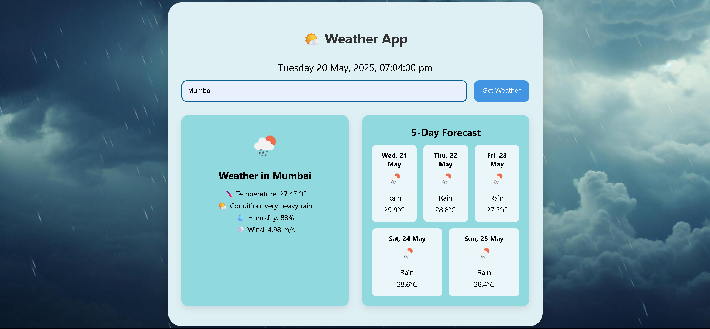

# Weather App 🌤️

A simple responsive weather app that fetches current weather data and forecast from the OpenWeather API.  
Built with HTML, CSS, and JavaScript.

### 📸 Preview

## 🚀 Features

- 🔍 Search weather by city
- 📍 Default weather for Mumbai on load
- 🌤️ Real-time temperature, condition, humidity, wind
- 📅 Live date & time
- 🖼️ Dynamic background based on weather
- 📱 Responsive design (mobile-friendly)
- 📊 5-day forecast with icons

## 🧪 Technologies Used

- HTML5
- CSS3 (Flexbox & Media Queries)
- Vanilla JavaScript
- OpenWeatherMap API

## Setup

1. Clone the repo  
   `git clone https://github.com/your-username/weather-app.git`

2. Open `index.html` in your browser

## API Key

This app uses OpenWeather API. You need your own API key to use it.

---

Made by Yash Sarode
